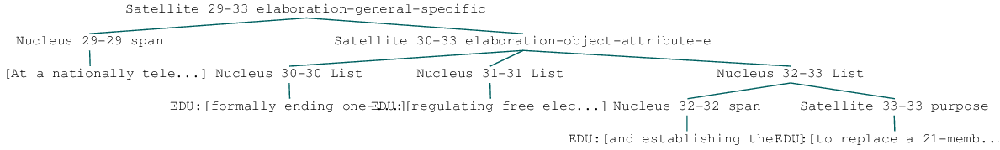
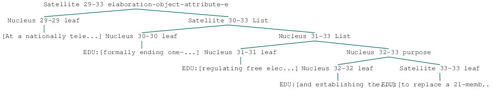
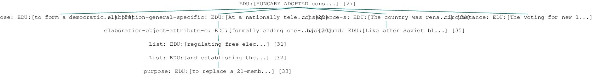
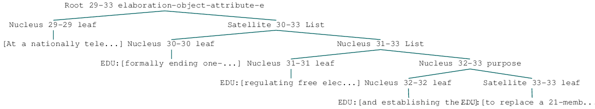

RST-DT
======

`Educe <http://kowey.github.io/educe>`__ is a library for working with a
variety of discourse corpora. This tutorial aims to show what using
educe would be like.

Installation
------------

.. code:: shell

    git clone https://github.com/irit-melodi/educe.git
    cd educe
    pip install -r requirements.txt

Note: these instructions assume you are running within a `virtual
environment <http://virtualenv.readthedocs.org/en/latest/>`__. If not,
and if you have permission denied errors, replace ``pip`` with
``sudo pip``.

Tutorial setup
--------------

RST-DT portions of this tutorial require that you have a local copy of
the RST Discourse Treebank. For purposes of this tutorial, you will need
to link this into the data directory, for example

::

    ln -s $HOME/CORPORA/rst_discourse_treebank data
    ln -s $HOME/CORPORA/PTBIII data

Tutorial in browser (optional)
~~~~~~~~~~~~~~~~~~~~~~~~~~~~~~

This tutorial can either be followed along with the command line and
your favourite text editor, or embedded in an interactive webpage via
iPython:

.. code:: shell

    pip install ipython
    cd tutorials
    ipython notebook

Reading corpus files (RST-DT)
-----------------------------

.. code:: python

    from __future__ import print_function
    import educe.rst_dt
    
    # relative to the educe docs directory
    data_dir = '../data'
    rst_corpus_dir = '{dd}/rst_discourse_treebank/data/RSTtrees-WSJ-double-1.0/'.format(dd=data_dir)
    
    # read and load the documents from the WSJ which were double-tagged
    rst_reader = educe.rst_dt.Reader(rst_corpus_dir)
    rst_corpus = rst_reader.slurp(verbose=True)
    
    # print a text fragment from the first ten files we read
    for key in rst_corpus.keys()[:10]:
        doc = rst_corpus[key]
        print("{0}: {1}".format(key.doc, doc.text()[:50]))

.. parsed-literal::

    Slurping corpus dir [51/53]

.. parsed-literal::

    wsj_1365.out: The Justice Department has revised certain interna
    wsj_0633.out: These are the last words Abbie Hoffman ever uttere
    wsj_1105.out: CHICAGO - Sears, Roebuck & Co. is struggling as it
    wsj_1168.out: Wang Laboratories Inc. has sold $25 million of ass
    wsj_1100.out: Westinghouse Electric Corp. said it will buy Shaw-
    wsj_1924.out: CALIFORNIA STRUGGLED with the aftermath of a Bay a
    wsj_0669.out: Nissan Motor Co. expects net income to reach 120 b
    wsj_0651.out: Nelson Holdings International Ltd. shareholders ap
    wsj_2309.out: Atco Ltd. said its utilities arm is considering bu
    wsj_1120.out: Japan has climbed up from the ashes of World War I

.. parsed-literal::

    Slurping corpus dir [53/53 done]

Faster reading
~~~~~~~~~~~~~~

If you know that you only want to work with a subset of the corpus
files, you can pre-filter the corpus before reading the files.

It helps to know here that an educe corpus is a mapping from `file id
keys <https://educe.readthedocs.org/en/latest/api-doc/educe.html#educe.corpus.FileId>`__
to documents. The FileId contains the minimally identifying metadata for
a document, for example, the document name, or its annotator. For
RST-DT, only the ``doc`` attribute is used.

.. code:: python

    rst_subset = rst_reader.filter(rst_reader.files(), 
                                   lambda k:k.doc.startswith("wsj_062"))
    rst_corpus_subset = rst_reader.slurp(rst_subset, verbose=True)
    for key in rst_corpus_subset:
        doc = rst_corpus_subset[key]
        print("{0}: {1}".format(key.doc, doc.text()[:50]))

.. parsed-literal::

    wsj_0627.out: October employment data -- also could turn out to 
    wsj_0624.out: Costa Rica reached an agreement with its creditor 

.. parsed-literal::

    Slurping corpus dir [2/2 done]

Trees and annotations
---------------------

RST DT documents are basically trees

.. code:: python

    from educe.corpus import FileId
    # an (ex)ample document
    ex_key = educe.rst_dt.mk_key("wsj_1924.out")
    ex_doc = rst_corpus[ex_key] # pick a document from the corpus
    
    # display PNG tree
    from IPython.display import display
    ex_subtree = ex_doc[2][0][0][1] # navigate down to a small subtree
    display(ex_subtree) # NLTK > 3.0b1 2013-07-11 should display a PNG image of the RST tree
    # Mac users: see note below

.. image:: rst-dt_files/rst-dt_6_0.png

Note for Mac users following along in iPython: if displaying the tree
above does not work (particularly if you see a GS prompt in your iPython
terminal window instead of an embedded PNG in your browser), try my
`NLTK
patch <https://github.com/kowey/nltk/commit/4ac4beacff7f9363c84e5d72719e2b5cda8267f2>`__
from 2014-09-17.

Standing off
~~~~~~~~~~~~

RST DT trees function both as NLTK trees, and as `educe standoff
annotations <http://educe.readthedocs.org/en/latest/api-doc/educe.html#educe.annotation.Standoff>`__.
Most annotations in educe can be seen as standoff annotations in some
sense; they (perhaps indirectly) extend ``educe.annotation.Standoff``
and provide a ``text_span()`` function. Comparing annotations usually
consists of comparing their text spans.

Text spans in the RST DT corpus refer to the source document beneath
each tree file, eg. for the tree file ``wsj_1111.out.dis``, educe reads
``wsj_1111.out`` as its source text. (The source text is somewhat
optional as the RST trees themselves contain text, but this tends to
have subtle differences with its underlying source). Below, we see an
example of one of these source documents.

.. code:: python

    ex_rst_txt_filename = '{corpus}/{doc}'.format(corpus=rst_corpus_dir,
                                                  doc=ex_key.doc)
    
    with open(ex_rst_txt_filename) as ifile:
        ex_txt = ifile.read()
        ex_snippet_start = ex_txt.find("At a national")
        print(ex_txt[ex_snippet_start:ex_snippet_start + 500])

.. parsed-literal::

    At a nationally televised legislative session in Budapest, the Parliament overwhelmingly approved changes formally ending one-party domination in the country, regulating free elections by next summer and establishing the office of state president to replace a 21-member council.
    The country was renamed the Republic of Hungary.
    Like other Soviet bloc nations, it had been known as a "people's republic" since 
    
    The voting for new laws followed dissolution of Hungary's Communist Party this month and 

Now let's have a closer look at the annotations themselves.

.. code:: python

    # it may be useful to have a couple of helper functions to
    # display standoff annotations in a generic way
    def text_snippet(text):
        "short text fragment"
        if len(text) < 43:
            return text
        else:
            return "{0}...{1}".format(text[:20], text[-20:])
    
    def preview_standoff(tystr, context, anno):
        "simple glimpse at a standoff annotation"
        span = anno.text_span()
        text = context.text(span)
        return "{tystr} at {span}:\t{snippet}".format(tystr=tystr,
                                                     span=span,
                                                     snippet=text_snippet(text))

EDUs and subtrees
~~~~~~~~~~~~~~~~~

.. code:: python

    # in educe RST/DT all annotations have a shared context object
    # that refers to an RST document; you don't always need to use
    # it, but it can be handy for writing general code like the
    # above
    ex_context = ex_doc.label().context
    
    # display some edus
    print("Some edus")
    edus = ex_subtree.leaves()
    for edu in edus:
        print(preview_standoff("EDU", ex_context, edu))
        
    print("\nSome subtrees")
    # display some RST subtrees and the edus they enclose
    for subtree in ex_subtree.subtrees():
        node = subtree.label()
        stat = "N" if node.is_nucleus() else "S"
        label = "{stat} {rel: <30}".format(stat=stat,
                                      rel=node.rel)
        print(preview_standoff(label, ex_context, subtree))

.. parsed-literal::

    Some edus
    EDU at (1504,1609):	At a nationally tele...gly approved changes
    EDU at (1610,1662):	formally ending one-...tion in the country,
    EDU at (1663,1703):	regulating free elections by next summer
    EDU at (1704,1750):	and establishing the...e of state president
    EDU at (1751,1782):	to replace a 21-member council.
    
    Some subtrees
    S elaboration-general-specific   at (1504,1782):	At a nationally tele...a 21-member council.
    N span                           at (1504,1609):	At a nationally tele...gly approved changes
    S elaboration-object-attribute-e at (1610,1782):	formally ending one-...a 21-member council.
    N List                           at (1610,1662):	formally ending one-...tion in the country,
    N List                           at (1663,1703):	regulating free elections by next summer
    N List                           at (1704,1782):	and establishing the...a 21-member council.
    N span                           at (1704,1750):	and establishing the...e of state president
    S purpose                        at (1751,1782):	to replace a 21-member council.

Paragraphs and sentences
~~~~~~~~~~~~~~~~~~~~~~~~

Going back to the source text, we can notice that it seems to be divided
into sentences and paragraphs with line separators. This does not seem
to be done very consistently, and in any case, RST constituents seem to
traverse these boundaries freely. But they can still make for useful
standoff annotations.

.. code:: python

    for para in ex_context.paragraphs[4:8]:
        print(preview_standoff("paragraph", ex_context, para))
        for sent in para.sentences:
            print("\t" + preview_standoff("sentence", ex_context, sent))

.. parsed-literal::

    paragraph at (862,1288):	The 77-year-old offi...o-democracy groups. 
    	sentence at (862,1029):	The 77-year-old offi...ttee in East Berlin.
    	sentence at (1030,1144):	Honecker, who was re... for health reasons.
    	sentence at (1145,1288):	He was succeeded by ...o-democracy groups. 
    paragraph at (1290,1432):	Honecker's departure...nted with his rule. 
    	sentence at (1290,1432):	Honecker's departure...nted with his rule. 
    paragraph at (1434,1502):	HUNGARY ADOPTED cons... democratic system. 
    	sentence at (1434,1502):	HUNGARY ADOPTED cons... democratic system. 
    paragraph at (1504,1913):	At a nationally tele...e's republic" since 
    	sentence at (1504,1782):	At a nationally tele...a 21-member council.
    	sentence at (1783,1831):	The country was rena...Republic of Hungary.
    	sentence at (1832,1913):	Like other Soviet bl...e's republic" since 

Penn Treebank integration
-------------------------

RST DT annotations are mostly over Wall Street Journal articles from the
Penn Treebank. If you have a copy of the latter at the ready, you can
ask educe to read and align the two (ie. PTB annotations treated as
standing off the RST source text). This alignment consists of some
universal substitutions (eg. ``-LBR-`` to ``(``) and with a `bit of
hardcoding <https://github.com/kowey/educe/blob/master/educe/rst_dt/ptb.py>`__
to account for seemingly random differences in whitespace/punctuation.

.. code:: python

    from educe.rst_dt import ptb
    from nltk.tree import Tree
    
    # confusingly, this is not an educe corpus reader, but the NLTK
    # bracketed reader.  Sorry
    ptb_reader = ptb.reader('{dd}/PTBIII/parsed/mrg/wsj/'.format(dd=data_dir))
    ptb_trees = {}
    for key in rst_corpus:
        ptb_trees[key] = ptb.parse_trees(rst_corpus, key, ptb_reader)
    
    # pick and display an arbitary ptb tree
    ex0_ptb_tree = ptb_trees[rst_corpus.keys()[0]][0]
    print(ex0_ptb_tree.pprint()[:400])

.. parsed-literal::

    (S
      (NP-SBJ
        (DT <educe.external.postag.Token object at 0x10e41ecd0>)
        (NNP <educe.external.postag.Token object at 0x10e41ee10>)
        (NNP <educe.external.postag.Token object at 0x10e41ef50>))
      (VP
        (VBZ <educe.external.postag.Token object at 0x10e41efd0>)
        (VP
          (VP
            (VBN <educe.external.postag.Token object at 0x10e41ef90>)
            (NP
              (JJ <educe.external.postag.

The result of this alignment is an educe ``ConstituencyTree``, the
leaves of which are educe ``Token`` objects. We'll say a little bit more
about these below.

.. code:: python

    # show what's beneath these educe tokens
    def str_tree(tree):
        if isinstance(tree, Tree):
            return Tree(str(tree.label()), map(str_tree, tree))
        else:
            return str(tree)
    
    print(str_tree(ex0_ptb_tree).pprint()[:400])

.. parsed-literal::

    (S
      (NP-SBJ
        (DT The/DT	(0,3))
        (NNP Justice/NNP	(4,11))
        (NNP Department/NNP	(12,22)))
      (VP
        (VBZ has/VBZ	(23,26))
        (VP
          (VP
            (VBN revised/VBN	(27,34))
            (NP
              (JJ certain/JJ	(35,42))
              (JJ internal/JJ	(43,51))
              (NNS guidelines/NNS	(52,62))))
          (CC and/CC	(63,66))
          (VP (VBN clarified/VBN	(67,76)) (NP (NNS others/NNS	(77,83))))
     

Combining annotations
---------------------

We now have several types of annotation at our disposal:

-  EDUs and RST trees
-  raw text paragraph/sentences (not terribly reliable)
-  PTB trees

The next question that arises is how we can use these annotations in
conjuction with each other.

Span enclosure and overlapping
~~~~~~~~~~~~~~~~~~~~~~~~~~~~~~

The simplest way to reason about annotations (particularly since they
tend to be sloppy and to overlap). Suppose for example, we wanted to
find all of the edus in a tree that are in the same sentence as an given
edu.

.. code:: python

    from itertools import chain
    
    # pick an EDU, any edu
    ex_edus = ex_subtree.leaves()
    ex_edu0 = ex_edus[3]
    print(preview_standoff('example EDU', ex_context, ex_edu0))
    
    # all of the sentences in the example document
    ex_sents = list(chain.from_iterable(x.sentences for x in ex_context.paragraphs))
    
    # sentences that overlap the edu
    # (we use overlaps instead of encloses because edus might
    # span sentence boundaries)
    ex_edu0_sents = [x for x in ex_sents if x.overlaps(ex_edu0)]
    
    # and now the edus that overlap those sentences
    ex_edu0_buddies = []
    for sent in ex_edu0_sents:
        print(preview_standoff('overlapping sentence', ex_context, sent))
        buddies = [x for x in ex_edus if x.overlaps(sent)]
        buddies.remove(ex_edu0)
        for edu in buddies:
            print(preview_standoff('\tnearby EDU', ex_context, edu))
        ex_edu0_buddies.extend(buddies)

.. parsed-literal::

    example EDU at (1704,1750):	and establishing the...e of state president
    overlapping sentence at (1504,1782):	At a nationally tele...a 21-member council.
    	nearby EDU at (1504,1609):	At a nationally tele...gly approved changes
    	nearby EDU at (1610,1662):	formally ending one-...tion in the country,
    	nearby EDU at (1663,1703):	regulating free elections by next summer
    	nearby EDU at (1751,1782):	to replace a 21-member council.

Span example 2 (exercise)
~~~~~~~~~~~~~~~~~~~~~~~~~

As an exercise, how about extracting the PTB part of speech tags for
every token in our example EDU? How for example, would you determine if
an EDU contains a VBG-tagged word?

.. code:: python

    ex_postags = list(chain.from_iterable(t.leaves() for t in ptb_trees[ex_key]))
    
    print("some of the POS tags")
    for postag in ex_postags[300:310]:
        print(preview_standoff(postag.tag, ex_context, postag))
        
    print()
    ex_edu0_postags = [] # EXERCISE <-- fill this in
    print("has VBG? ", ) # EXERCISE <-- fill this in

.. parsed-literal::

    some of the POS tags
    VBG at (1663,1673):	regulating
    JJ at (1674,1678):	free
    NNS at (1679,1688):	elections
    IN at (1689,1691):	by
    JJ at (1692,1696):	next
    NN at (1697,1703):	summer
    CC at (1704,1707):	and
    VBG at (1708,1720):	establishing
    DT at (1721,1724):	the
    NN at (1725,1731):	office
    
    has VBG? 

Tree searching
~~~~~~~~~~~~~~

The same span enclosure logic can be used to search parse trees for
particular constituents, verb phrases. Alternatively, you can use the
the ``topdown`` method provided by educe trees. This returns just the
largest constituent for which some predicate is true. It optionally
accepts an additional argument to cut off the search when it is clearly
out of bounds.

.. code:: python

    ex_ptb_trees = ptb_trees[ex_key]
    ex_edu0_ptb_trees = [x for x in ex_ptb_trees if x.overlaps(ex_edu0)]
    ex_edu0_cons = []
    for ptree in ex_edu0_ptb_trees:
        print(preview_standoff('ptb tree', ex_context, ptree))
        ex_edu0_cons.extend(ptree.topdown(lambda c: ex_edu0.encloses(c)))
        
    # the largest constituents enclosed by this edu
    for cons in ex_edu0_cons:
        print(preview_standoff(cons.label(), ex_context, cons))
        
    display(ex_edu0_cons[3])

.. parsed-literal::

    ptb tree at (1504,1782):	At a nationally tele...a 21-member council.
    CC at (1704,1707):	and
    VBG at (1708,1720):	establishing
    NP at (1721,1731):	the office
    PP at (1732,1750):	of state president
    WHNP-1 at (1750,1750):	
    NP-SBJ at (1750,1750):	

.. image:: rst-dt_files/rst-dt_25_1.png

Simplified trees
----------------

The tree representation used in the RST DT can take some getting used to
(relation labels are placed on the satellite rather than the root of a
subtree). You may prefer to work with the simplified representation
instead. In the simple representation, trees are binarised and relation
labels are moved to the root node. Compare for example, the two versions
of the same RST subtree.

.. code:: python

    # rearrange the tree so that it is easier to work with
    ex_simple_subtree = educe.rst_dt.SimpleRSTTree.from_rst_tree(ex_subtree)
    print('Corpus representation\n\n')
    display(ex_subtree)
    print('Simplified (binarised, rotated) representation\n\n')
    display(ex_simple_subtree)

.. parsed-literal::

    Corpus representation
    
    

.. parsed-literal::

    Simplified (binarised, rotated) representation
    
    

Dependency trees and back
-------------------------

Educe also provides an experimental conversion between simplified trees
above and dependency trees. See the
`educe.rst\_dt.deptree <https://educe.readthedocs.org/en/latest/api-doc/educe.rst_dt.html#module-educe.rst_dt.deptree>`__
for the algorithm used.

Our current example is a little too small to give a sense of what the
resulting dependency tree might look like, so we'll back up slightly
closer to the root to have a wider view.

.. code:: python

    from educe.rst_dt import deptree
    
    ex_subtree2 = ex_doc[2]
    ex_simple_subtree2 = educe.rst_dt.SimpleRSTTree.from_rst_tree(ex_subtree2)
    ex_deptree2 = deptree.relaxed_nuclearity_to_deptree(ex_simple_subtree2)
    display(ex_deptree2)

Going back to our original example, we can (lossily) convert back from
these dependency tree representations to RST trees. The dependency trees
have some ambiguities in them that we can't resolve without an oracle,
but we can at least make some guesses. Note that when converting back to
RST, we need to supply a list of relation labels that should be treated
as multinuclear.

.. code:: python

    ex_deptree = deptree.relaxed_nuclearity_to_deptree(ex_simple_subtree)
    ex_from_deptree = deptree.relaxed_nuclearity_from_deptree(ex_deptree, ["list"]) # multinuclear in lowercase
    display(ex_from_deptree)

Conclusion
----------

In this tutorial, we've explored a couple of basic educe concepts, which
we hope will enable you to extract some data from your discourse
corpora, namely

-  reading corpus data (and pre-filtering)
-  standoff annotations
-  searching by span enclosure, overlapping
-  working with trees
-  combining annotations from different sources

The concepts above should transfer to whatever discourse corpus you are
working with (that educe supports, or that you are prepared to supply a
reader for).

That said, some of the features mentioned in particular tutorial are
specific to the RST DT:

-  simplifying RST trees
-  converting them to dependency trees
-  PTB integration

This tutorial was last updated on 2014-09-18. Educe is a bit of a moving
target, so `let me know <https://github.com/kowey/educe/issues>`__ if
you run into any trouble!

See also
~~~~~~~~

rst-dt-util
^^^^^^^^^^^

Some of the things you may want to do with the RST DT may already exist
in the rst-dt-util command line tool. See ``rst-dt-util --help`` for
more details.

(At the time of this writing the only really useful tool is the
rst-dt-util reltypes one, which prints an inventory of relation labels,
but the utility may grow over time)

External tool support
^^^^^^^^^^^^^^^^^^^^^

Educe has some support for reading data from outside the discourse
corpus proper. For example, if you run the stanford corenlp parser on
the raw text, you can read them back into educe-style
``ConstituencyTree`` and ``DependencyTree`` annotations. See
`educe.external <https://educe.readthedocs.org/en/latest/api-doc/educe.external.html>`__
for details.

If you have a part of speech tagger that you would like to use, the
``educe.external.postag`` module may be useful for representing the
annotations that come out of it

You can also add support for your own tools by creating annotations that
extend ``Standoff``, directly or otherwise.
