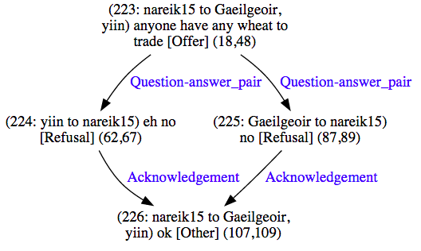
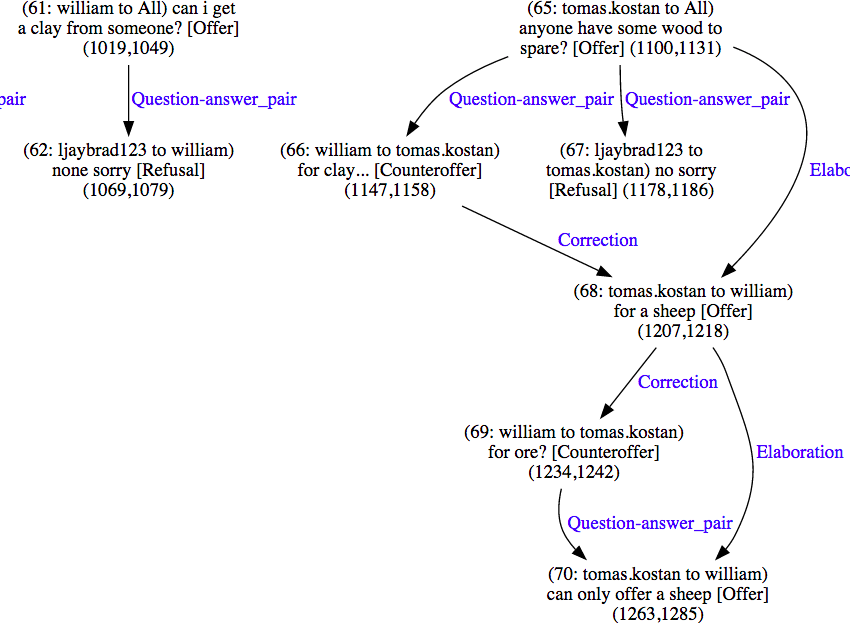
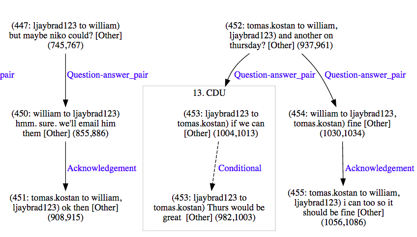

STAC tools
==========

Educe comes with a number of command line utilities for querying, checking,
and modifying the STAC corpus:

* stac-util: queries
* stac-check: sanity checks (development)
* stac-edit: modifications to (development)
* stac-oneoff: rare modifications (development)

The first tool (stac-util) may be useful to all users of the STAC corpus,
whereas the last three (stac-check, stac-edit, and stac-oneoff) may be more
of interest for corpus development work.

stac-util
---------
The stac-util toolkit provides some potentially useful queries on the corpus.

stac-util text
~~~~~~~~~~~~~~
Dump the text in documents along with segment annotations ::

    stac-util text --doc s2-leagueM-game2\
        --subdoc 02 --anno 'BRONZE|SILVER|GOLD' --stage discourse

This utility can be useful for getting a sense for what a particular
document contains, without having to fire up the Glozz platform ::

    ========== s2-leagueM-game2 [02] discourse SILVER ============
    
    72 : gotwood4sheep : [anyone got wood?]
    73 : gotwood4sheep : [i can offer sheep]
    74 : gotwood4sheep : [phrased in such a way i don't riff on my un]
    75 : inca : [i'm up for that]
    76 : CheshireCatGrin : [I have no wood]
    77 : gotwood4sheep : [1:1?]
    78 : inca : [yep,] [only got one]
    81 : gotwood4sheep : [matt, do you got clay?]  [I can offer many things]
    82 : CheshireCatGrin : [No clay either]
    83 : gotwood4sheep : [anyone else?]
    84 : dmm : [i think clay is in short supply]
    85 : inca : [sorry,] [none here either]
    86 : gotwood4sheep : [indeed, something to do with a robber on the 5]
    87 : gotwood4sheep : [alas]

stac-util count
~~~~~~~~~~~~~~~
Display some basic counts on the corpus or a given subset thereof ::

    stac-util count --doc s1-league3-game4

The output includes the number of instances of EDUs, turns, etc ::

    Document structure
    ============================================================
    
    per doc      total    min    max    mean    median
    ---------  -------  -----  -----  ------  --------
    doc              1
    subdoc           3      3      3       3         3
    dialogue         7      7      7       7         7
    turn star       25     25     25      25        25
    turn            28     28     28      28        28
    edu             58     58     58      58        58
    ...

along with dialogue-acts and relation instances... ::

    Relation instances
    ============================================================
    
    BRONZE                  total
    --------------------  -------
    Comment                     3
    Elaboration                 1
    Acknowledgement             4
    Continuation                4
    Explanation                 1
    Q-Elab                      3
    Result                      3
    Background                  1
    Parallel                    2
    Question-answer_pair        8
    TOTAL                      30
    ...

stac-util count-rfc
~~~~~~~~~~~~~~~~~~~
Count right frontier violations given all the RFC algorithms we have
implemented::

    stac-util count-rfc --doc pilot21

Output for the above includes both a total count and a pers label count ::

    Both                      total    basic    mlast
    ----------------------  -------  -------  -------
    TOTAL                       290       33       11
    Question-answer_pair         91        4        0
    Comment                      32        7        5
    Continuation                 23        3        1
    Elaboration                  22        4        0
    Q-Elab                       22        3        1
    Acknowledgement              20        2        0
    ...

stac-util count-shapes
~~~~~~~~~~~~~~~~~~~~~~
Count and draw the number of instances of shapes that we deem to be interesting
(for now, this only means “lozenges”, but we may come up with other shapes in
the future, for example, instances of nodes with in-degree > 1) ::

    stac-util count-shapes --anno 'GOLD|SILVER|BRONZE'\
        --output /tmp/graphs\
        data/socl-season1

Aside from the graph below, this displays a per-document count along with
the total ::

    s1-league2-game1 [14] discourse SILVER 1 (4)
    s1-league2-game2 [01] discourse GOLD 3 (23)
    s1-league2-game2 [02] discourse GOLD 1 (5)
    s1-league2-game2 [03] discourse GOLD 1 (6)
    s1-league2-game3 [03] discourse BRONZE 2 (10)
    s1-league2-game4 [01] discourse BRONZE 1 (4)
    s1-league2-game4 [03] discourse BRONZE 1 (6)
    ...
    TOTAL lozenges: 46
    TOTAL edges in lozenges: 234

stac-util graph
~~~~~~~~~~~~~~~
Draw the discourse graph for a corpus ::

    stac-util graph --doc s1-league1-game2 --anno SILVER\
        --output /tmp/graphs\
        data/socl-season1

Tips:

* `--strip-cdus` shows what the graph would look like
  with an automated CDU-removing algorithm applied to it
* `--rfc <algo>` will highlight the right frontier and
  violations given an RFC algorithm (eg `--rfc basic`)

stac-util filter-graph
~~~~~~~~~~~~~~~~~~~~~~
View all instances of a relation (or set of relations) ::

     stac-util filter-graph --doc s1-league1-game2\
         --output /tmp/graphs\
         data/socl-season1\
         Question-answer_pair Acknowledgement

(Sorry, easy mode not available)

stac-check
----------
The STAC corpus (at the time of this writing 2015-06-12) is a work in progress,
and so some of our utilities are geared at making it easier to clean up the
annotations we have. The STAC sanity checker can be used to see what problems
there are with the current crop of annotations.

The sanity checker is best run in easy mode in the STAC development directory
(ie. the project SVN at the time of this writing): ::

    stac-check --doc pilot03

It will output a report directory in a temporary location (something like
`/tmp/sanity-pilot03/`). The report will be in HTML (with links to some
styled XML documents and SVG graphs) and so should be viewed in a browser.

stac-edit and stac-oneoff
-------------------------
stac-edit and stac-oneoff are probably best reserved for people interested in
refining the annotations in the STAC corpus. See the `--help` options for these
tools or get in touch with us for our internal documentation

User interface notes
--------------------

Command line filters
~~~~~~~~~~~~~~~~~~~~
The stac utilities tend to use the same idiom of filtering the corpus on the
command line. For example, the following command will try to display the text
for all (sub)documents in the training-2015-05-30 corpus whose document names
start with "pilot"; and subdocument is either '02', '03', or '04'; and which
in the 'discourse' stage and by the annotator 'GOLD' ::

    stac-util text --doc 'pilot'\
                   --subdoc '0[2-4]'\
                   --stage 'discourse'\
                   --anno 'GOLD'\
        data/FROZEN/training-2015-05-30

As we can see above, the filters are Python regular expressions, which can
sometimes be useful for expressing range matches. It's also possible to
filter as much or as little as you want, for example with this subcommand
showing EVERY gold-annotated document in that corpus ::

    stac-util text --anno 'GOLD' data/FROZEN/training-2015-05-30

Or this command which displays every single document there is ::

    stac-util text data/FROZEN/training-2015-05-30

Easy mode
~~~~~~~~~

The commands generally come with an "easy mode" where you need only
specify a single document via '--doc' ::

    stac-util text --doc pilot03

If you do this, the stac utilities will guess that you wanted the development
corpus directory and sometimes some sensible flags to go with it.

Note that "easy mode" does not preclude the use of other flags; you could also
still have complex filters like the following ::

    stac-util text --doc pilot03 --subdoc '0[2-4]' --anno GOLD

Easy mode is available for stac-check, stac-edit, stac-oneoff, and stac-util.
